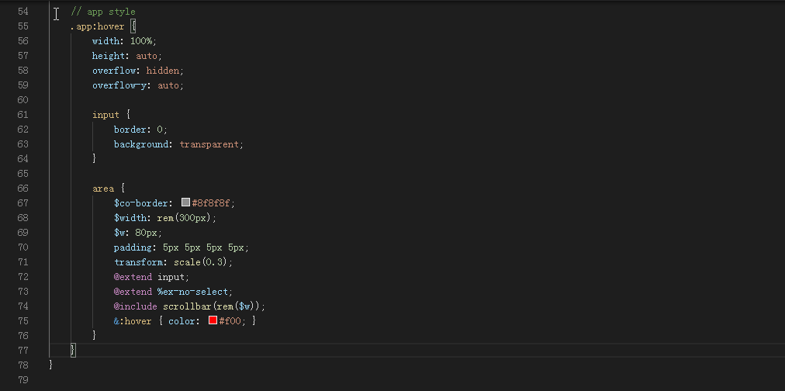

# vscode-style-compressor

Compress each definitions in `css` to single line

[https://github.com/edp1096/vscode-style-compressor](https://github.com/edp1096/vscode-style-compressor)

 
For `scss`, please use original extension

Forked from [vscode-scss-format](https://github.com/xxxxst/vscode-scss-format)

## Appended features
* Add 1 more line break at comment - `\n/* blahblah */`
* Disable space removing for child selector finding, @identifier
    * `.parent .child {`
    * `@media only screen and (max-width:1234px) {`
* Compress all in the active opened file when select nothing

## demo

## Shortcut key
- win `Ctrl + Shift + i`
- mac `Cmd + Shift + i`
